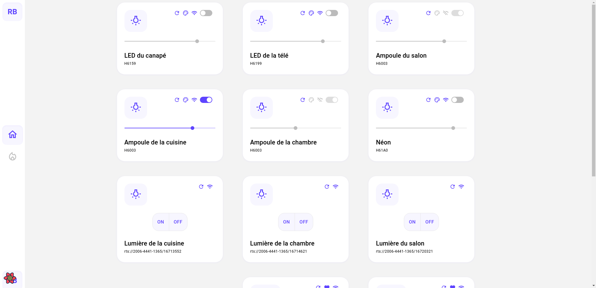

## 🏡 Super-Home

Super-Home is a work-in-progress application that aims to centralize and control connected devices (e.g., Somfy, Govee) from a single web interface.

## 📶 Project Status 

🚧 This project is currently under development.

## 📷 Screenshot

## Installation and Setup Instructions 💻

Clone down this repository. You will need `node` and `pnpm` installed globally on your machine.

Installation:

`pnpm install`

To Run Test Suite:

`pnpm test`

To Start Server:

`pnpm run dev`

Open [http://localhost:5173/dashboard](http://localhost:5173/dashboard) to view it in the browser.

> The page will reload if you make edits.\ You will also see any lint errors in the console.

`pnpm build`

Builds the app for production to the `build` folder.\
It correctly bundles React in production mode and optimizes the build for the best performance.

The build is minified and the filenames include the hashes.\

